# Ex-06-Feature-Transformation
# AIM:
To read the given data and perform Feature Transformation process and save the data to a file.

# EXPLANATION:
Feature Transformation is a technique by which we can boost our model performance. Feature transformation is a mathematical transformation in which we apply a mathematical formula to a particular column(feature) and transform the values which are useful for our further analysis.

# ALGORITHM:
STEP 1:Read the given Data.

STEP 2: Clean the Data Set using Data Cleaning Process.

STEP 3: Apply Feature Transformation techniques to all the features of the data set.

STEP 4: Print the transformed features.

# PROGRAM:

Developed by: ARSHATHA P

Register No. : 212222230012
```py

import numpy as np
import pandas as pd
import matplotlib.pyplot as plt
import statsmodels.api as sm
import scipy.stats as stats
df = pd.read_csv("/content/Data_to_Transform.csv")
print(df)
df.head()
df.isnull().sum()
df.info()
df.describe()

df1 = df.copy()
sm.qqplot(df1['Highly Positive Skew'],fit=True,line='45')
plt.show()

sm.qqplot(df1['Highly Negative Skew'],fit=True,line='45')
plt.show()

sm.qqplot(df1['Moderate Positive Skew'],fit=True,line='45')
plt.show()

sm.qqplot(df1['Moderate Negative Skew'],fit=True,line='45')
plt.show()

df1['Highly Positive Skew'] = np.log(df1['Highly Positive Skew'])
sm.qqplot(df1['Highly Positive Skew'],fit=True,line='45')
plt.show()

df2 = df.copy()
df2['Highly Positive Skew'] = 1/df2['Highly Positive Skew']
sm.qqplot(df2['Highly Positive Skew'],fit=True,line='45')
plt.show()

df3 = df.copy()
df3['Highly Positive Skew'] = df3['Highly Positive Skew']**(1/1.2)
sm.qqplot(df2['Highly Positive Skew'],fit=True,line='45')
plt.show()

df4 = df.copy()
df4['Moderate Positive Skew_1'],parameters =stats.yeojohnson(df4['Moderate Positive Skew'])
sm.qqplot(df4['Moderate Positive Skew_1'],fit=True,line='45')
plt.show()

from sklearn.preprocessing import PowerTransformer 
trans = PowerTransformer("yeo-johnson")
df5 = df.copy()
df5['Moderate Negative Skew_1'] = pd.DataFrame(trans.fit_transform(df5[['Moderate Negative Skew']]))
sm.qqplot(df5['Moderate Negative Skew_1'],line='45')
plt.show()

from sklearn.preprocessing import QuantileTransformer
qt = QuantileTransformer(output_distribution = 'normal')
df5['Moderate Negative Skew_2'] = pd.DataFrame(qt.fit_transform(df5[['Moderate Negative Skew']]))
sm.qqplot(df5['Moderate Negative Skew_2'],line='45')
plt.show()

```
# OUTPUT:

## DATASET

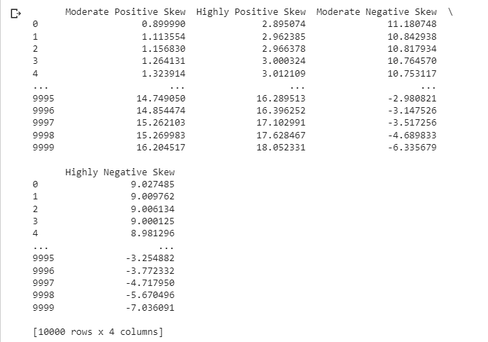
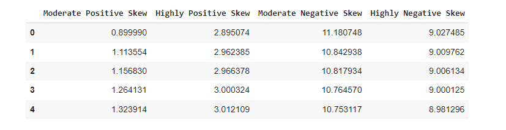

## ISNULL

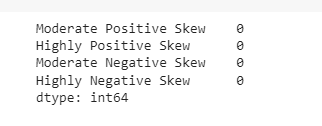

## INFO

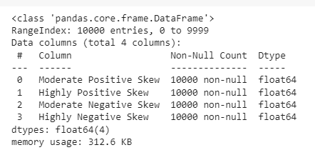

## DESCRIBE

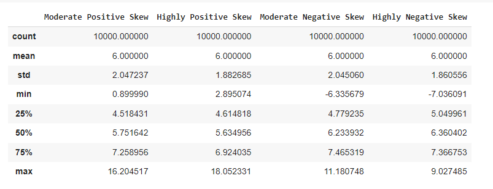

## HIGHLY POSITIVE SKEW

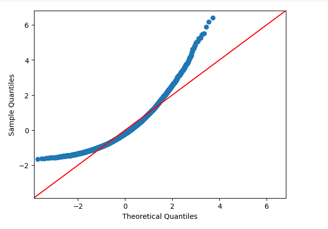

## HIGHLY NEGATIVE SKEW

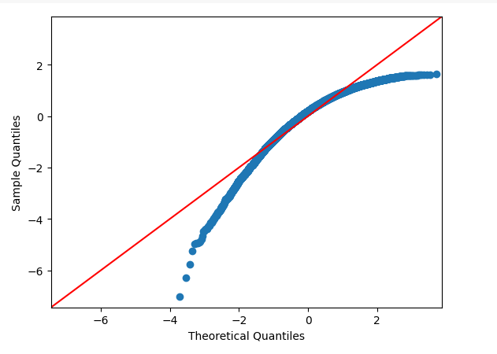

## MODERATE POSITIVE SKEW


## MODERATE NEGATIVE SKEW

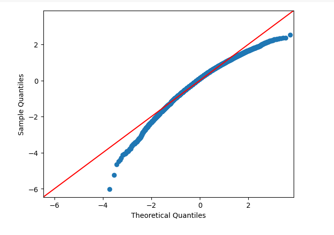

## LOG OF MODERATE POSITIVE SKEW

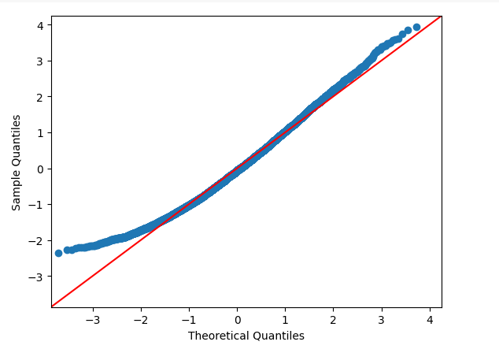

## LOG OF HIGHLY POSITIVE SKEW

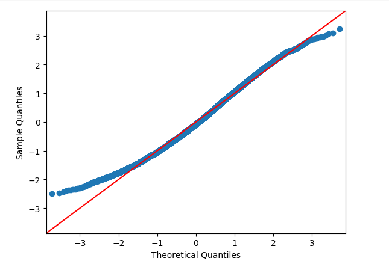

## RECIPROCAL OF HIGHLY POSITIVE SKEW 

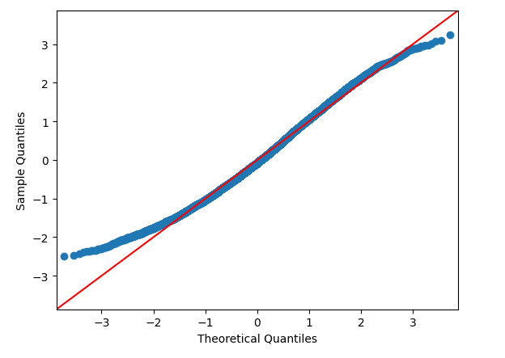

##  SQUARE ROOT TRANSFORMATION


##  POWER TRANSFORMATION OF MODERATE NEGATIVE SKEW

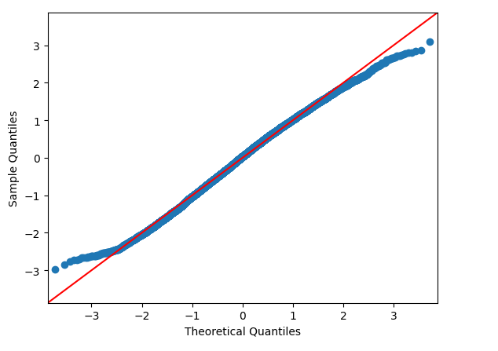

## QUANTILE TRANSFORMATION

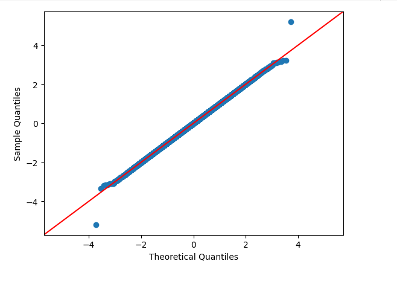

# RESULT:
Thus, Feature transformation is performed and executed successfully for the given dataset.
